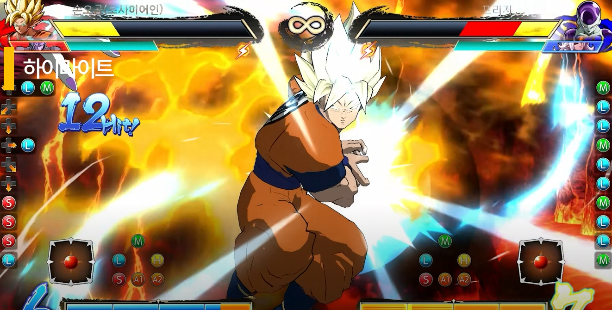
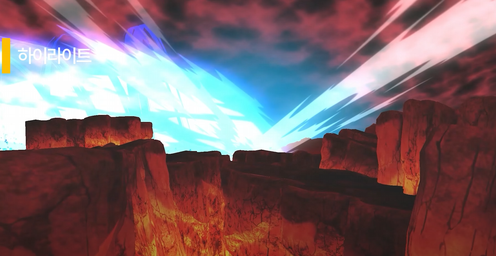
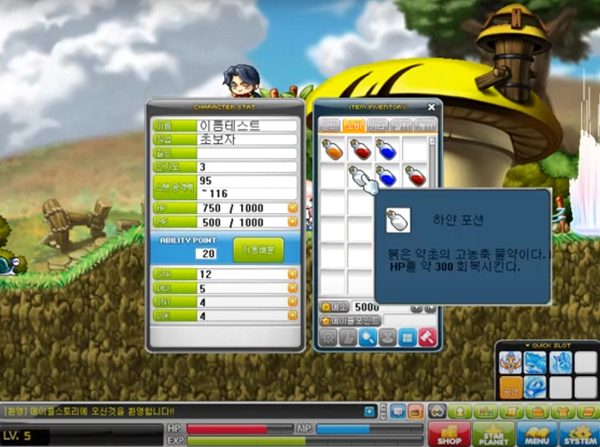
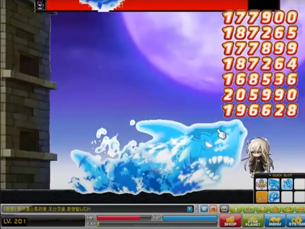
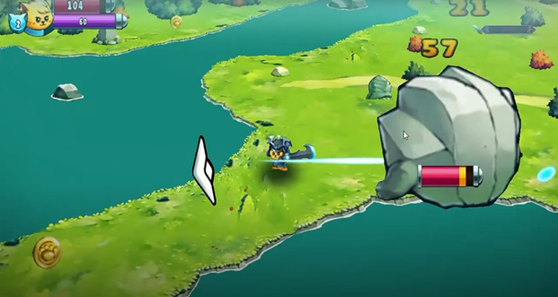
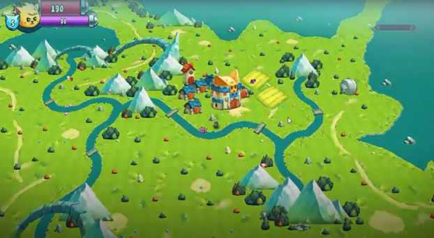
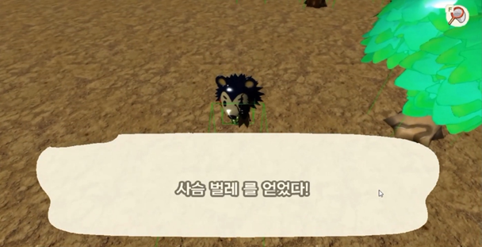
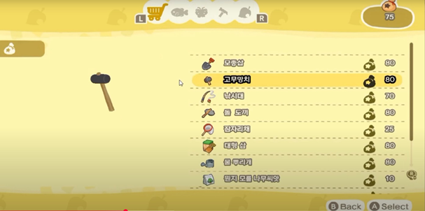

# Dragonball_Highlighted_Code

  

개발 기간 :
5인 팀 프로젝트 2024.10 ~ 2024.11 (2개월)

##  시연 영상 
- [하이라이트 (00:00 ~ 2:13)](https://youtu.be/DtVysCjJ9Xc?t=0)
- [내 파트 (9:37 ~ 16:20)](https://youtu.be/DtVysCjJ9Xc?t=578)
- [인게임 플레이 (34:51 ~ 40:40)](https://youtu.be/DtVysCjJ9Xc?t=2092)
- [전체 영상 보기](https://youtu.be/DtVysCjJ9Xc)
  
# 주요 구현 코드 설명 (Core Implementation Highlights)

## 1. FrameEvent_Manager
**애니메이션 프레임 기반 이벤트 처리 시스템**

- 격투 게임 특유의 공격 타이밍 / 이펙트 / 사운드 등을 애니메이션 프레임에 맞춰 실행하기 위해 설계
- 애니메이션 이름 + 프레임 번호를 키로 삼아, 프레임마다 이벤트를 트리거함
- 슬라이더 UI 기반 툴로 프레임 확인 및 이벤트 편집 가능 (ImGui 사용)

관련 코드:
- [FrameEvent_Manager.cpp](./FrameEvent_Manager.cpp)
- [FrameEvent_Manager.h](./FrameEvent_Manager.h)

---

## 2. Character
**캐릭터 상태 및 조작 전체 담당**

격투 게임 장르는 단순한 이동/점프 외에도,
- 프레임 타이밍 기반 입력 반응
- 슈퍼아머, 체공기, 커맨드 스킬 등 예외 케이스
- 가속도/넉백/피격 경직/무적 등 복합 상태 처리
- 프레임 이벤트 시스템과의 통합 연동

등을 고려해야 하기 때문에, 일반적인 캐릭터보다 코드가 구조적으로 복잡해질 수밖에 없습니다.

이 구조에서는 다음을 목표로 설계했습니다:
- 캐릭터 공통 기능을 기반 클래스에서 정의하고, 캐릭터마다 상속 구조로 분리
- 상태별 세분화된 처리 (이동, 공격, 피격 등)를 함수 단위로 나눠 가독성과 유지보수성 확보
- 애니메이션/이벤트/이펙트/사운드 동기화

관련 코드:
- [Character.cpp](./Character.cpp)
- [Character.h](./Character.h)

---

## 3. AttackObject_CommandGrab
**커맨드 잡기 공격 오브젝트**

- 특정 조건에서만 유효한 Grab 판정을 생성
- 히트 여부에 따라 연출/이동 처리 분기
- 충돌/거리/상태 조건을 고려한 특수 오브젝트 설계

🔗 관련 코드:
- [AttackObject_CommandGrab.cpp](./AttackObject_CommandGrab.cpp)
- [AttackObject_CommandGrab.h](./AttackObject_CommandGrab.h)

---

그 외 시연 영상들

개인 프로젝트 2024.02 ~ 2024.03 (3개월)
  [메이플스토리](https://youtu.be/3Ge3nKeh894)

4인 팀 프로젝트 2024.05 ~ 2024.06 (2개월)
  [Cat Quest](https://youtu.be/oEqXF39BLMo)

  

개인 프로젝트 2024.07 ~ 2024.09 (1개월)
  [동물의 숲](https://youtu.be/DtVysCjJ9Xc)

